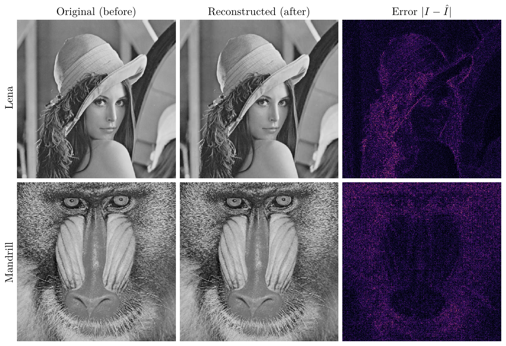
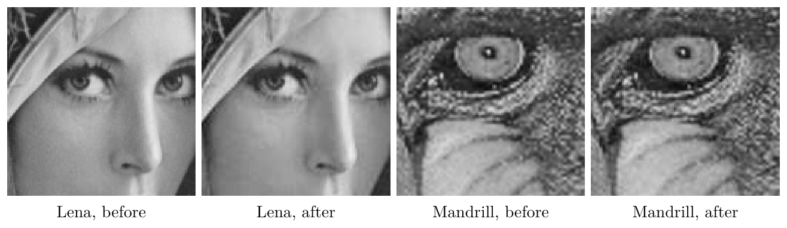
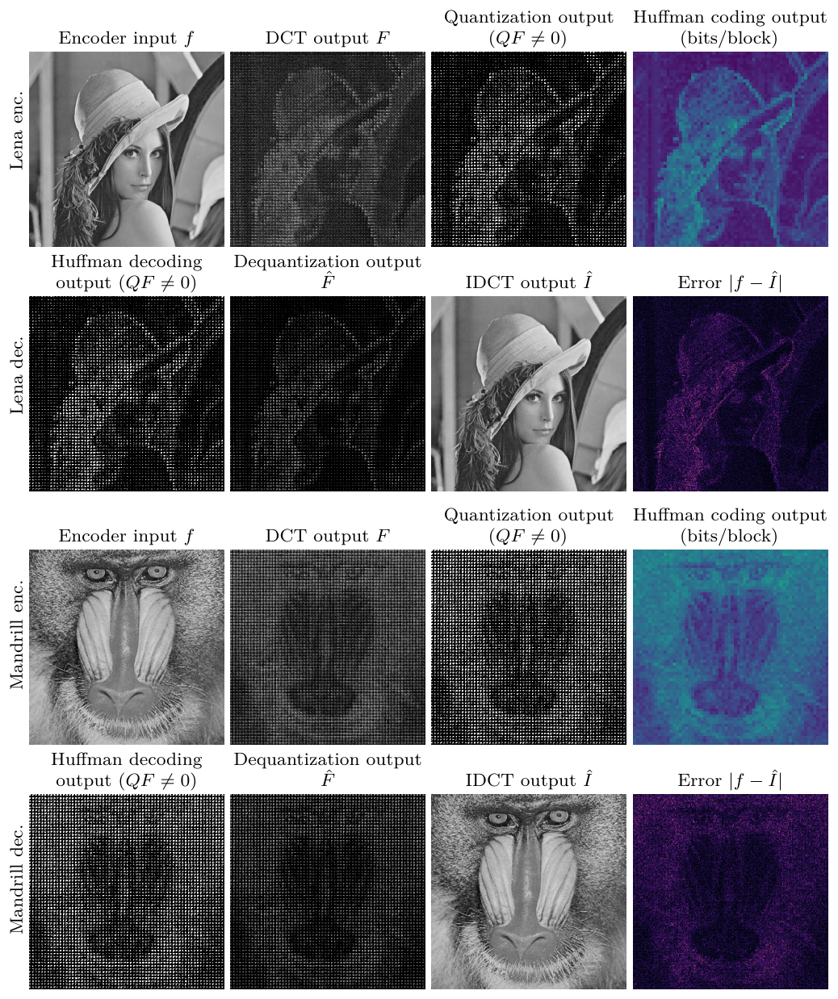
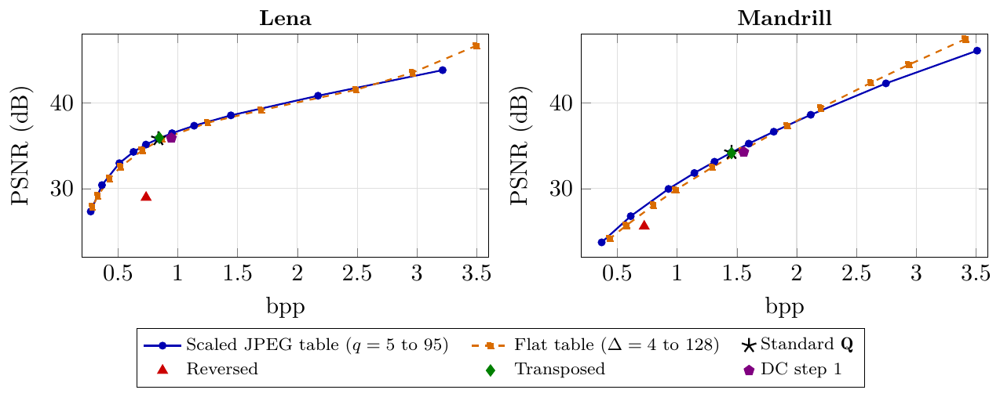
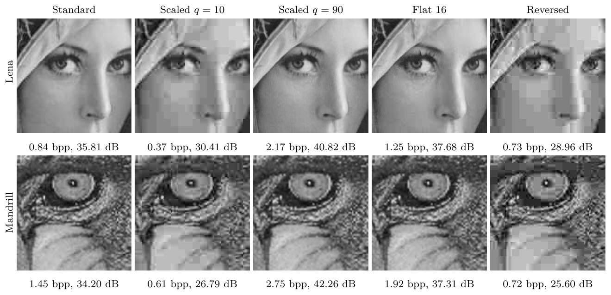
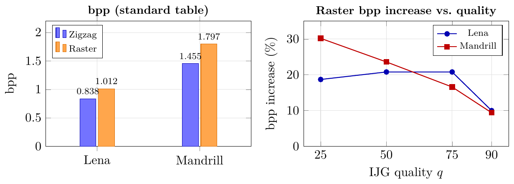
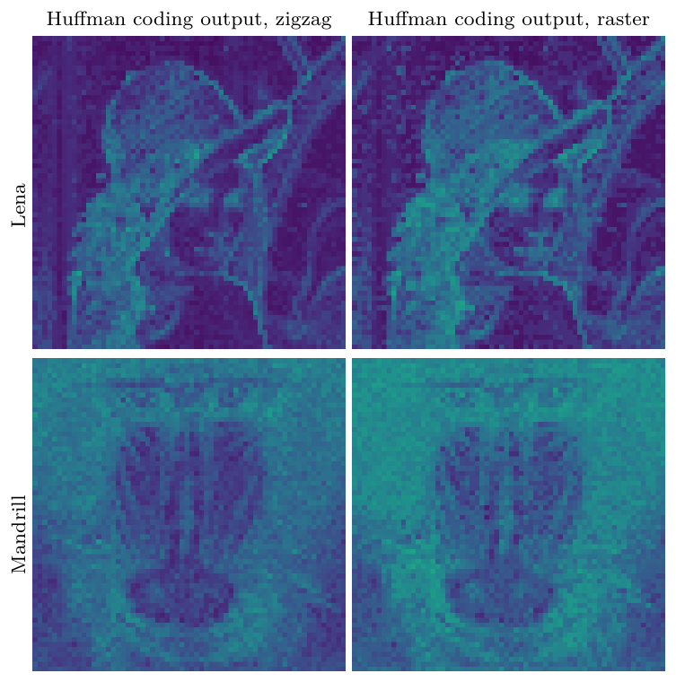
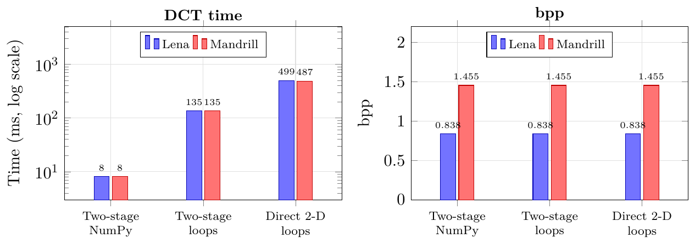
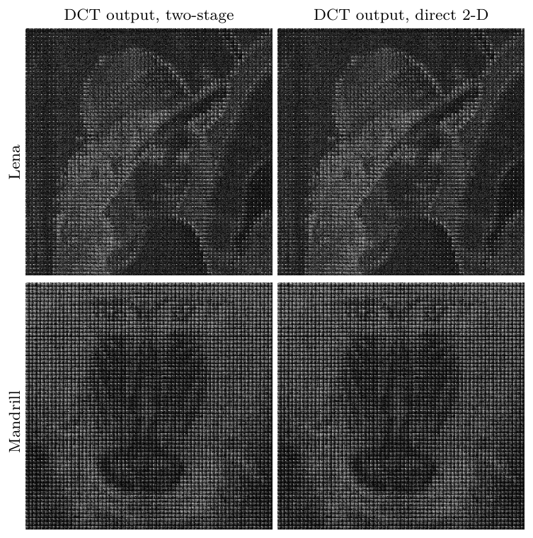

# Video Compression HW1: Spatial Coding

| Student | Student ID | University | Course |
|---|---|---|---|
| Pham Minh Long 龍志 | 314540080 | National Yang Ming Chiao Tung University (NYCU) | Video Compression, Fall 2026 |

## Introduction

A JPEG style spatial codec for 8-bit grayscale images, built on the course template ([VC_HW1.pdf](VC_HW1.pdf)).
Each 8x8 block is transformed, quantized, zigzag scanned and Huffman coded into a bitstream, and the decoder inverts every stage to rebuild the image.

| Stage | Encoder | Decoder |
|---|---|---|
| Transform | Level shift by 128, row-wise then column-wise 1-D DCT with the given basis `C` | Column-wise then row-wise 1-D IDCT, level shift, rounding and clipping to `[0, 255]` |
| Quantization | `QF = rint(F / Q)` with the standard luminance table, range check `[-2047, 2047]` | `F_hat = QF * Q` |
| Scan | Zigzag order into 64 values | Inverse zigzag |
| Entropy coding | `VALUE(v)` category code plus amplitude bits, `EOB` after the last non-zero value, MSB first | Prefix decoding (up to 9 bits) and amplitude recovery |

**Highlights**

- Block 0 traces and final metrics match the course reference for Lena and Mandrill within every tolerance.
- DCT and IDCT use only the provided basis matrix `C`, with no built-in transform functions.
- bpp is measured from the real `.bin` file, and the decoder validates the header, padding bits and leftover payload bits.
- Three ablation studies: quantization table, zigzag against raster scan, and two-stage 1-D DCT against direct 2-D DCT.
- Full write-up in the report [HW1_314540080.pdf](HW1_314540080.pdf).

## Setup

| Python | NumPy | Pillow | Use |
|---|---|---|---|
| 3.12.9 | 2.5.3 | 12.1.1 | `outputs/`, `ablation/results.json` and the report |
| 3.9.6 | 1.24.3 | 10.0.1 | Output identical to the reference files, bit for bit |

```bash
conda create -n vc python=3.12 -y
conda activate vc
pip install numpy pillow
brew install tectonic
```

Tectonic is only needed to build the report. The test data comes with the assignment and is already in `data/`:

| File | Description |
|---|---|
| `data/lena_gray.png` | Lena, 512x512, 8-bit grayscale |
| `data/mandril_gray.png` | Mandrill, 512x512, 8-bit grayscale |
| `data/lena_reference_output.txt` | Reference encoder trace, decoder trace and evaluation for Lena |
| `data/mandril_reference_output.txt` | Reference encoder trace, decoder trace and evaluation for Mandrill |

## Usage

### Encode, decode and evaluate

```bash
mkdir -p outputs
python encoder.py data/lena_gray.png outputs/output.bin --trace outputs/encoder_trace.txt --block-index 0
python decoder.py outputs/output.bin outputs/reconstructed.png --trace outputs/decoder_trace.txt --block-index 0
python evaluate.py data/lena_gray.png outputs/reconstructed.png outputs/output.bin
```

| Step | Output |
|---|---|
| Encoder | `outputs/output.bin` (4-byte header and Huffman payload), `outputs/encoder_trace.txt` |
| Decoder | `outputs/reconstructed.png`, `outputs/decoder_trace.txt` |
| Evaluation | MSE, PSNR, bpp and bit counts printed to the terminal |

### Check both test images against the reference

```bash
for img in lena mandril; do
  python encoder.py data/${img}_gray.png outputs/${img}.bin --trace outputs/${img}_encoder_trace.txt > /dev/null
  python decoder.py outputs/${img}.bin outputs/${img}_reconstructed.png --trace outputs/${img}_decoder_trace.txt > /dev/null
  python evaluate.py data/${img}_gray.png outputs/${img}_reconstructed.png outputs/${img}.bin
done
```

Compare the traces and the printed metrics with `data/{img}_reference_output.txt`.

### Ablation studies

Run `ablation.py` first, because `extra.py` reads and updates the `results.json` it writes.

```bash
python ablation/ablation.py
python ablation/extra.py
python ablation/stage_figs.py
```

| Script | Task | Output |
|---|---|---|
| `ablation/ablation.py` | Quantization table sweep, scan orders and DCT methods. Every variant writes a real `.bin` file and decodes it with the submitted functions | `ablation/results.json` |
| `ablation/extra.py` | Times the four DCT versions again with interleaved runs and takes the median | `ablation/results.json` |
| `ablation/stage_figs.py` | Block input and output maps, decoded crops per Q table, bits per block maps | `report/figures/*.png` |

### Report, figures and submission

```bash
cd report && tectonic --outdir .. HW1_314540080.tex && cd ..
python report/export_figures.py
rm -f HW1_314540080.zip
zip -j HW1_314540080.zip encoder.py decoder.py HW1_314540080.pdf
```

| Step | Output |
|---|---|
| Build the report | `HW1_314540080.pdf` |
| Export the report figures as PNG for this README | `outputs/figures/*.png` |
| Create the submission | `HW1_314540080.zip` with `encoder.py`, `decoder.py` and `HW1_314540080.pdf` at its root, no ablation code |

## Results

All numbers come from Python 3.12.9 and NumPy 2.5.3 on an Apple M2 (`outputs/` and `ablation/results.json`), on the two 512x512 test images.

### Codec against the reference

| Metric | Lena reference | Lena ours | Mandrill reference | Mandrill ours | Tolerance |
|---|---:|---:|---:|---:|---|
| Valid payload bits | 219548 | 219544 | 381276 | 381278 | 27 bits |
| File size (bytes) | 27448 | 27447 | 47664 | 47664 | not specified |
| bpp | 0.837646 | **0.837616** | 1.454590 | **1.454590** | 0.0001 |
| MSE | 17.069725 | 17.069817 | 24.699440 | 24.699432 | 0.01 |
| PSNR (dB) | 35.808538 | **35.808515** | 34.203933 | **34.203934** | 0.01 |

The small payload difference comes from floating-point rounding in the DCT. With NumPy 1.24.3 both images match the reference exactly.


*Before and after coding with the standard Q table, and the absolute error.*


*Zoomed crops (3 times).*


*Input and output of each block for the standard codec.*

### Ablation 1: quantization table (bpp, PSNR)

Scaled tables use the libjpeg quality formula, where `q = 50` gives the standard table. Flat tables use one step for all 64 coefficients.

| Table | Lena bpp | Lena PSNR (dB) | Mandrill bpp | Mandrill PSNR (dB) |
|---|---:|---:|---:|---:|
| Standard `Q` (baseline) | 0.8376 | 35.81 | 1.4546 | 34.20 |
| Scaled, `q = 10` (coarser) | 0.3656 | 30.41 | 0.6120 | 26.79 |
| Scaled, `q = 90` (finer) | 2.1726 | 40.82 | 2.7464 | 42.26 |
| Flat, step 16 | 1.2505 | 37.68 | 1.9207 | 37.31 |
| Transposed `Q` | 0.8455 | 35.92 | 1.4552 | 34.14 |
| Reversed `Q(7-u, 7-v)` | 0.7347 | 28.96 | 0.7249 | 25.60 |
| DC step 1, `Q(0,0) = 1` | 0.9457 | 35.89 | 1.5570 | 34.26 |

<details>
<summary>Full rate and distortion sweep</summary>

| Quality `q` | Lena bpp | Lena PSNR (dB) | Mandrill bpp | Mandrill PSNR (dB) |
|---:|---:|---:|---:|---:|
| 5 | 0.2715 | 27.33 | 0.3689 | 23.73 |
| 10 | 0.3656 | 30.41 | 0.6120 | 26.79 |
| 20 | 0.5111 | 32.96 | 0.9279 | 29.96 |
| 30 | 0.6292 | 34.28 | 1.1443 | 31.82 |
| 40 | 0.7330 | 35.13 | 1.3125 | 33.13 |
| 50 | 0.8376 | 35.81 | 1.4546 | 34.20 |
| 60 | 0.9512 | 36.46 | 1.5992 | 35.24 |
| 70 | 1.1363 | 37.33 | 1.8083 | 36.63 |
| 80 | 1.4438 | 38.54 | 2.1176 | 38.60 |
| 90 | 2.1726 | 40.82 | 2.7464 | 42.26 |
| 95 | 3.2145 | 43.81 | 3.5090 | 46.08 |

| Flat step | Lena bpp | Lena PSNR (dB) | Mandrill bpp | Mandrill PSNR (dB) |
|---:|---:|---:|---:|---:|
| 4 | 3.4969 | 46.66 | 3.4106 | 47.42 |
| 6 | 2.9603 | 43.50 | 2.9380 | 44.44 |
| 8 | 2.4884 | 41.51 | 2.6196 | 42.33 |
| 12 | 1.6977 | 39.13 | 2.1991 | 39.38 |
| 16 | 1.2505 | 37.68 | 1.9207 | 37.31 |
| 24 | 0.8665 | 35.79 | 1.5428 | 34.43 |
| 32 | 0.7018 | 34.46 | 1.2940 | 32.48 |
| 48 | 0.5218 | 32.55 | 0.9891 | 29.86 |
| 64 | 0.4301 | 31.16 | 0.8025 | 28.06 |
| 96 | 0.3310 | 29.16 | 0.5750 | 25.70 |
| 128 | 0.2848 | 27.88 | 0.4381 | 24.18 |

</details>


*PSNR and bpp of the quantization table variants.*


*Decoded crops (IDCT output) with different Q tables.*

### Ablation 2: zigzag against raster scan (bpp, PSNR)

Raster order reads the block row by row in both the encoder and the decoder. PSNR does not change because the scan only reorders the same quantized values.

| Image | Scan | bpp | bpp increase | PSNR (dB) | `VALUE(0)` per block |
|---|---|---:|---:|---:|---:|
| Lena | Zigzag | 0.8376 | baseline | 35.809 | 4.58 |
| Lena | Raster | 1.0121 | +20.8% | 35.809 | 10.17 |
| Mandrill | Zigzag | 1.4546 | baseline | 34.204 | 7.63 |
| Mandrill | Raster | 1.7971 | +23.6% | 34.204 | 18.59 |

bpp increase of raster over zigzag at other quality levels:

| Quality `q` | Lena | Mandrill |
|---:|---:|---:|
| 25 | +18.7% | +30.2% |
| 50 | +20.8% | +23.6% |
| 75 | +20.8% | +16.6% |
| 90 | +10.0% | +9.4% |


*The bpp of zigzag and raster (left) and the bpp increase of raster at different quality (right).*


*Bits per block after Huffman coding (blue means few bits, yellow means many bits).*

### Ablation 3: two-stage 1-D DCT against direct 2-D DCT (time, bpp)

The direct version computes the double sum `F(u,v) = sum_x sum_y C(u,x) f(x,y) C(v,y)` with four nested loops. Time covers only the DCT of one full image (median of repeated runs).

| Implementation | Multiplications per block | Lena time (ms) | Mandrill time (ms) | Lena bpp | Mandrill bpp |
|---|---:|---:|---:|---:|---:|
| Two-stage, NumPy (submitted) | 1024 | 8.11 | 8.10 | 0.837616 | 1.454590 |
| Two-stage, Python loops | 1024 | 134.93 | 134.98 | 0.837616 | 1.454590 |
| Direct 2-D, Python loops | 4096 | 498.78 | 486.83 | 0.837616 | 1.454559 |

With the same loop style, the direct DCT is about 3.6 to 3.7 times slower than the two-stage DCT. Both compute the same transform, so bpp only moves by a few bits from floating-point rounding.


*DCT time (log scale) and bpp.*


*DCT output of the two methods, shown as log(1 + |F|).*
